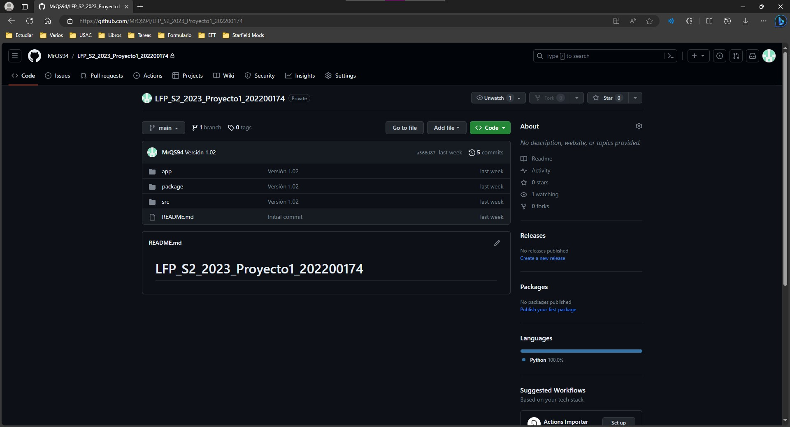
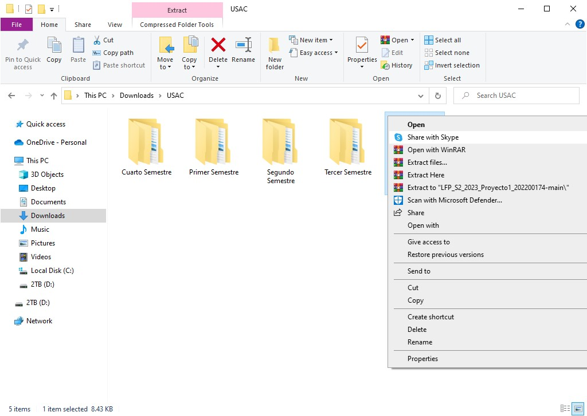
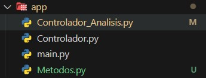

# Manual Técnico - Aplicación Numérica con Análisis Léxico
Nombre del Estudiante: Andres Alejandro Quezada Cabrera

Carné: 202200174

Curso y Sección: LENGUAJES FORMALES DE PROGRAMACIÓN Sección B+

Carrera: Ingenieria en Ciencias y Sistemas

Universidad de San Carlos de Guatemala 4to. Semestre del 2023
## Introducción

Este Manual Técnico está diseñado como una guía detallada para comprender y utilizar eficazmente la aplicación desarrollada en Python descrita en la introducción anterior. La aplicación tiene como objetivo principal analizar y ejecutar código fuente en formato JSON, reconocer el lenguaje de programación utilizado, identificar errores léxicos, y representar gráficamente los resultados de las operaciones realizadas.

Este manual está dirigido a programadores, desarrolladores y profesionales de la informática que desean aprovechar al máximo las capacidades de esta herramienta para simplificar sus tareas de desarrollo y análisis de código. A lo largo de este manual, se proporcionarán instrucciones detalladas sobre cómo utilizar la aplicación, desde la instalación y la interfaz de usuario hasta el análisis léxico y la generación de resultados gráficos.

### INSATALACIÓN Y USO DEL PROGRAMA
Ir al siguiente link de [github](https://github.com/MrQS94/LFP_S2_2023_Proyecto1_202200174). Acá encontrarán el código fuente del programa.
 - Primero seleccionar en el botón code y seleccionar en descargar zip.

 - Luego de eso se descargará un archivo zip el cual necesitaremos extraer en una carpeta deseada, esta carpeta puede estar en cualquier lugar de su computadora, pero lo podemos incluir dentro de alguna carpeta de VS.

 - Abrimos el proyecto, luego de eso a nosotros nos aparecerá, cuatro paquetes los cuales son
llamados app, img, package, src y los manuales, en el paquete app se encuentra el archivo que inicia el programa main.py.

Ahora en el paquete app se encuentran los siguientes archivos
 - Controlador_Analisis.py
 - Controlador_Interfaz.py
 - main.py
 - Modelo.py

En los siguientes paquetes se encuentra un resumen de los archivos correspondientes

- Controlador_Analisis.py: Este archivo se encarga de realizar el análisis léxico del archivo JSON, y de generar los reportes de errores léxicos y gráfico, sobreotodo existen métodos encargados originalmente de realizar el análisis léxico, pero se modificaron para que se encargaran de generar los reportes.
- Controlador_Interfaz.py: Este archivo se encarga de realizar la interfaz gráfica del programa, y de realizar las funciones de los botone, aquí se encuentra el método que se encarga de abrir el archivo JSON y de analizar cada parte de las palabras introducidas.
- main.py: Este archivo se encarga de iniciar el programa, y de llamar a los métodos de la interfaz gráfica.
- Modelo.py: Este archivo se encarga de realizar la clase abstracta de los tokens, y de realizar la clase de analisis, errores léxicos y los metodos deseados.